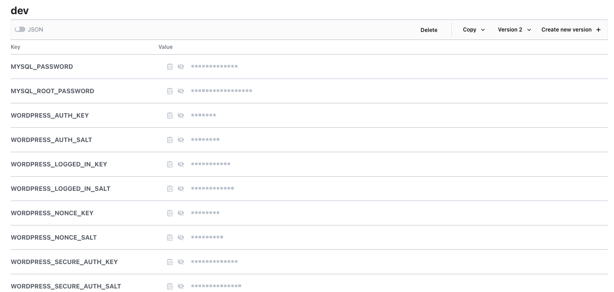

# WordPress deployments
*All commands are given from root of the repository.

## OpenShift template deployments are deprecated
**Warning**  Use of the OpenShift templates including image builds and deployments will be deprecated in favour of using Kustomize deployments.  Refer to [OpenShift Template Deployment](https://github.com/bcgov/wordpress/tree/bb8fd6066bcc2087605c50f941b8b906dc0e9b61/openshift/templates)


## Local deployment with Docker
[Deploying WordPress with Docker Compose](../../dev/README.md)

## Local deployment with Kubernetes and Kustomize

### Set local Kubernetes context
Assuming you have rancher desktop installed, you might have different contexts, especially if you deploy OpenShift applications.

* To get a list of all contexts you can run ```kubectl config get-contexts```
* If you are deploying locally then you will want to set your context, if not already set. Lets assume our local context is rancher-desktop.
* Set context ```kubectl config use-context rancher-desktop```
  * If successful you should see something like:
  * `Switched to context "rancher-desktop"`

### Deploy with Kustomize
* [Kustomize](https://kubectl.docs.kubernetes.io/) is a standalone tool to customize Kubernetes objects through a kustomization file, that ships with both OC and kubectl deployment utilities.
* To make local deployments more seamless, all images are being pulled from DockerHub [bcgovgdx namespace](https://hub.docker.com/?namespace=bcgovgdx).
* These images should **NOT** be used in production deployments.
* Prerequisites
  * Kubernetes cluster 
  * Kubectl installed
* Deploy using ```kubectl apply -k ./deployments/kustomize/overlays/local```
* To **Delete** your deployment use:
  * ```kubectl delete -k ./deployments/kustomize/overlays/local```
  * CAUTION this will delete all resources, including volumes
* Your new site should be accessible at http://0.0.0.0:30080/ 
* WordPress networks can't be used due to the port restrictions.

#### Access the sidecar
* Find the sidecar pod by running ```kubectl get pods``` then replace the pod name in the command.
* ```kubectl exec -it  pod/wordpress-sidecar-abcd -- bash```
* cd /var/www/html
* you can now run [wp cli](https://wp-cli.org/) commands, however locally this container is running in root so you will have to use the --allow-root flag
* sample command ```wp plugin list --allow-root```


## Deploying images to OpenShift tools namespace
* In order for deployments in openshift to work, you will have to generate your own overlay which will point to the `./deployments/kustomize/overlays/openshift/images` folder of this repo.
* Update your license plate in the kustomization.yaml file.

#### Sample overlay for image deployment in tool namespace
```yaml
# my-image-deploy/kustomization.yaml
apiVersion: kustomize.config.k8s.io/v1beta1
kind: Kustomization
# Points to the overlay that creates the images.
resources:
- github.com/bcgov/wordpress/deployments/kustomize/overlays/openshift/images
# Update to your license plate in the tools namespace.
namespace: 123456-tools
```

### Deploying images used for WordPress deployments
* Login to OpenShift via the `oc` command line.
* Deploy your images to OpenShift ```oc apply -k my-image-deploy``` 
  * Deploying the images, will **not** trigger a build, this has to be done manually in OpenShift.


## OpenShift deployment with OpenShift secrets
* Create Kustomization.yaml file for example my-wordpress-deploy/kustomization.yaml
  * Update your namespace with your license plate and the OpenShift environment (dev|test|prod). Ex. 123456-dev
  * Update your images to point to your tools repo with your license plate.
* Add your patch file my-wordpress-deploy/patch.yaml
  * include the route with the update host url
* Deploy WordPress to OpenShift ```oc apply -k my-wordpress-deploy```
* Visit your site at my-wordpress-url.com to finish the installation.

### Sample Overlay for WordPress deployment to dev namespace with secrets
```yaml
# my-wordpress-deploy/kustomization.yaml
apiVersion: kustomize.config.k8s.io/v1beta1
kind: Kustomization
# Points to the overlay that creates the images.
resources:
- github.com/bcgov/wordpress/deployments/kustomize/overlays/openshift
# Update to your license plate in the dev|test|prod namespace.
namespace: 123456-dev
images:
  - name: wordpress-mariadb-run
    newName: image-registry.openshift-image-registry.svc:5000/123456-tools/wordpress-mariadb-run
    newTag: dev
  - name: wordpress-wordpress-run
    newName: image-registry.openshift-image-registry.svc:5000/123456-tools/wordpress-wordpress-run
    newTag: dev
  - name: wordpress-nginx-run
    newName: image-registry.openshift-image-registry.svc:5000/123456-tools/wordpress-nginx-run
    newTag: dev
  - name: wordpress-sidecar-run
    newName: image-registry.openshift-image-registry.svc:5000/123456-tools/wordpress-sidecar-run
    newTag: dev
configMapGenerator:
- name: wordpress-config
  behavior: merge
  literals:
  - APP_DOMAIN=my-wordpress-url.com
# The Secrets, do not use these secrets in your deployment.
secretGenerator:
- name: wordpress-secrets
  type: Opaque
  behavior: merge
  literals:
  - MYSQL_PASSWORD=mysqlpassword
  - MYSQL_ROOT_PASSWORD=rootmysqlpassword
  - WORDPRESS_AUTH_KEY=authkey
  - WORDPRESS_SECURE_AUTH_KEY=secureauthkey
  - WORDPRESS_LOGGED_IN_KEY=loggedinkey
  - WORDPRESS_NONCE_KEY=noncekey
  - WORDPRESS_AUTH_SALT=authsalt
  - WORDPRESS_SECURE_AUTH_SALT=secureauthsalt
  - WORDPRESS_LOGGED_IN_SALT=loggedinsalt
  - WORDPRESS_NONCE_SALT=noncesalt
patchesStrategicMerge:
- patch.yaml
```

### Sample WordPress deploy overlay patch file with secrets
```yaml
# my-wordpress-deploy/patch.yaml
apiVersion: route.openshift.io/v1
kind: Route
metadata:
  name: wordpress-nginx
  annotations:
     haproxy.router.openshift.io/ip_whitelist: >-
      # Add all IP's to whitelist, to only allow certain IP ranges.
spec:
  host: my-wordpress-url.com
```


## OpenShift deployment with Vault secrets
* Create Kustomization.yaml file for example my-wordpress-deploy-with-vault/kustomization.yaml
  * Update your namespace with your license plate, and env you to deploy (dev|test|prod)
  * Update your images to point to your tools repo with your license plate.
* Add your patch file my-wordpress-deploy-with-vault/patch.yaml
  * include the route with the update host url
  * Update the license plate for the vault on all the deployments
    * These are some possibilities 123456-nonprod/123456-prod
    * Update the mysite to the directory that the vault secrets are located.
  * Add [vault secrets](https://docs.developer.gov.bc.ca/vault-secrets-management-service/)
    * Each entry in the deployment patches should have a matching vault secret. See figure 1
    * If vault secrets are not created before deployment, deployment will fail.
    * Vault secret implementation could change in further version, to optimize consumption of secrets.
* Deploy WordPress to OpenShift ```oc apply -k my-wordpress-deploy-with-vault```
* Visit your site at my-wordpress-url.com to finish the installation.


#### Sample Overlay for WordPress deployment to dev namespace with Vault secrets
```yaml
# my-wordpress-deploy-with-vault/kustomization.yaml
apiVersion: kustomize.config.k8s.io/v1beta1
kind: Kustomization
# Points to the overlay that creates the images.
resources:
- github.com/bcgov/wordpress/deployments/kustomize/overlays/openshift-vault
# Update to your license plate in the dev|test|prod namespace.
namespace: 123456-dev
images:
  - name: wordpress-mariadb-run
    newName: image-registry.openshift-image-registry.svc:5000/123456-tools/wordpress-mariadb-run
    newTag: dev
  - name: wordpress-wordpress-run
    newName: image-registry.openshift-image-registry.svc:5000/123456-tools/wordpress-wordpress-run
    newTag: dev
  - name: wordpress-nginx-run
    newName: image-registry.openshift-image-registry.svc:5000/123456-tools/wordpress-nginx-run
    newTag: dev
  - name: wordpress-sidecar-run
    newName: image-registry.openshift-image-registry.svc:5000/123456-tools/wordpress-sidecar-run
    newTag: dev
configMapGenerator:
- name: wordpress-config
  behavior: merge
  literals:
  - APP_DOMAIN=my-wordpress-url.co
patchesStrategicMerge:
- patch.yaml
```

#### Sample WordPress deploy overlay patch file with Vault secrets.
```yaml
# my-wordpress-deploy-with-vault/patch.yaml
apiVersion: route.openshift.io/v1
kind: Route
metadata:
  name: wordpress-nginx
  annotations:
     haproxy.router.openshift.io/ip_whitelist: >-
      # Add all ip's to whitelist, to only allow certain ip ranges, ie Only ally if on VPN.
spec:
  host: my-wordpress-url.com

---
apiVersion: apps/v1
kind: Deployment
metadata:
  name: wordpress-mariadb
spec:
  template:
    metadata:
      annotations:
        vault.hashicorp.com/role: 123456-nonprod
        vault.hashicorp.com/agent-inject-secret-mysql_password: 123456-nonprod/mysite
        vault.hashicorp.com/agent-inject-template-mysql_password: |
          {{- with secret "123456-nonprod/mysite" -}}
          {{ .Data.data.MYSQL_PASSWORD }}
          {{- end }}
        vault.hashicorp.com/agent-inject-secret-mysql_root_password: 123456-nonprod/mysite
        vault.hashicorp.com/agent-inject-template-mysql_root_password: |
          {{- with secret "123456-nonprod/mysite" -}}
          {{ .Data.data.MYSQL_PASSWORD }}
          {{- end }}
    spec:
      serviceAccountName: 123456-vault
      serviceAccount: 123456-vault
---
apiVersion: apps/v1
kind: Deployment
metadata:
  name: wordpress
spec:
  template:
    metadata:
      annotations:
        vault.hashicorp.com/agent-inject-secret-mysql_password: 123456-nonprod/mysite
        vault.hashicorp.com/agent-inject-template-mysql_password: |
          {{- with secret "123456-nonprod/mysite" -}}
          {{ .Data.data.MYSQL_PASSWORD }}
          {{- end }}
        vault.hashicorp.com/agent-inject-secret-mysql_root_password: 123456-nonprod/mysite
        vault.hashicorp.com/agent-inject-template-mysql_root_password: |
          {{- with secret "123456-nonprod/mysite" -}}
          {{ .Data.data.MYSQL_ROOT_PASSWORD }}
          {{- end }}
        vault.hashicorp.com/agent-inject-secret-wordpress_auth_key: 123456-nonprod/mysite
        vault.hashicorp.com/agent-inject-template-wordpress_auth_key: |
          {{- with secret "123456-nonprod/mysite" -}}
          {{ .Data.data.WORDPRESS_AUTH_KEY }}
          {{- end }}
        vault.hashicorp.com/agent-inject-secret-wordpress_auth_salt: 123456-nonprod/mysite
        vault.hashicorp.com/agent-inject-template-wordpress_auth_salt: |
          {{- with secret "123456-nonprod/mysite" -}}
          {{ .Data.data.WORDPRESS_AUTH_SALT_FILE }}
          {{- end }}
        vault.hashicorp.com/agent-inject-secret-wordpress_logged_in_key: 123456-nonprod/mysite
        vault.hashicorp.com/agent-inject-template-wordpress_logged_in_key: |
          {{- with secret "123456-nonprod/mysite" -}}
          {{ .Data.data.WORDPRESS_LOGGED_IN_KEY_FILE }}
          {{- end }}
        vault.hashicorp.com/agent-inject-secret-wordpress_logged_in_salt: 123456-nonprod/mysite
        vault.hashicorp.com/agent-inject-template-wordpress_logged_in_salt: |
          {{- with secret "123456-nonprod/mysite" -}}
          {{ .Data.data.WORDPRESS_LOGGED_IN_SALT_FILE }}
          {{- end }}
        vault.hashicorp.com/agent-inject-secret-wordpress_nonce_key: 123456-nonprod/mysite
        vault.hashicorp.com/agent-inject-template-wordpress_nonce_key: |
          {{- with secret "123456-nonprod/mysite" -}}
          {{ .Data.data.WORDPRESS_NONCE_KEY_FILE }}
          {{- end }}
        vault.hashicorp.com/agent-inject-secret-wordpress_nonce_salt: 123456-nonprod/mysite
        vault.hashicorp.com/agent-inject-template-wordpress_nonce_salt: |
          {{- with secret "123456-nonprod/mysite" -}}
          {{ .Data.data.WORDPRESS_NONCE_SALT_FILE }}
          {{- end }}
        vault.hashicorp.com/agent-inject-secret-wordpress_secure_auth_key: 123456-nonprod/mysite
        vault.hashicorp.com/agent-inject-template-wordpress_secure_auth_key: |
          {{- with secret "123456-nonprod/mysite" -}}
          {{ .Data.data.WORDPRESS_SECURE_AUTH_KEY_FILE }}
          {{- end }}
        vault.hashicorp.com/agent-inject-secret-wordpress_secure_auth_salt: 123456-nonprod/mysite
        vault.hashicorp.com/agent-inject-template-wordpress_secure_auth_salt: |
          {{- with secret "123456-nonprod/mysite" -}}
          {{ .Data.data.WORDPRESS_SECURE_AUTH_SALT_FILE }}
          {{- end }}
        vault.hashicorp.com/role: 123456-nonprod
    spec:
      serviceAccountName: 123456-vault
      serviceAccount: 123456-vault
---
apiVersion: apps/v1
kind: Deployment
metadata:
  name: wordpress-sidecar
spec:
  template:
    metadata:
      annotations:
        vault.hashicorp.com/role: 123456-nonprod
        vault.hashicorp.com/agent-inject-secret-mysql_password: 123456-nonprod/mysite
        vault.hashicorp.com/agent-inject-template-mysql_password: |
          {{- with secret "123456-nonprod/mysite" -}}
          {{ .Data.data.MYSQL_PASSWORD }}
          {{- end }}
        vault.hashicorp.com/agent-inject-secret-mysql_root_password: 123456-nonprod/mysite
        vault.hashicorp.com/agent-inject-template-mysql_root_password: |
          {{- with secret "123456-nonprod/mysite" -}}
          {{ .Data.data.MYSQL_PASSWORD }}
          {{- end }}
        vault.hashicorp.com/agent-inject-secret-wordpress_auth_key: 123456-nonprod/mysite
        vault.hashicorp.com/agent-inject-template-wordpress_auth_key: |
          {{- with secret "123456-nonprod/mysite" -}}
          {{ .Data.data.WORDPRESS_AUTH_KEY }}
          {{- end }}
        vault.hashicorp.com/agent-inject-secret-wordpress_auth_salt: 123456-nonprod/mysite
        vault.hashicorp.com/agent-inject-template-wordpress_auth_salt: |
          {{- with secret "123456-nonprod/mysite" -}}
          {{ .Data.data.WORDPRESS_AUTH_SALT }}
          {{- end }}
        vault.hashicorp.com/agent-inject-secret-wordpress_logged_in_key: 123456-nonprod/mysite
        vault.hashicorp.com/agent-inject-template-wordpress_logged_in_key: |
          {{- with secret "123456-nonprod/mysite" -}}
          {{ .Data.data.WORDPRESS_LOGGED_IN_KEY }}
          {{- end }}
        vault.hashicorp.com/agent-inject-secret-wordpress_logged_in_salt: 123456-nonprod/mysite
        vault.hashicorp.com/agent-inject-template-wordpress_logged_in_salt: |
          {{- with secret "123456-nonprod/mysite" -}}
          {{ .Data.data.WORDPRESS_LOGGED_IN_SALT }}
          {{- end }}
        vault.hashicorp.com/agent-inject-secret-wordpress_nonce_key: 123456-nonprod/mysite
        vault.hashicorp.com/agent-inject-template-wordpress_nonce_key: |
          {{- with secret "123456-nonprod/mysite" -}}
          {{ .Data.data.WORDPRESS_NONCE_KEY }}
          {{- end }}
        vault.hashicorp.com/agent-inject-secret-wordpress_nonce_salt: 123456-nonprod/mysite
        vault.hashicorp.com/agent-inject-template-wordpress_nonce_salt: |
          {{- with secret "123456-nonprod/mysite" -}}
          {{ .Data.data.WORDPRESS_NONCE_SALT }}
          {{- end }}
        vault.hashicorp.com/agent-inject-secret-wordpress_secure_auth_key: 123456-nonprod/mysite
        vault.hashicorp.com/agent-inject-template-wordpress_secure_auth_key: |
          {{- with secret "123456-nonprod/mysite" -}}
          {{ .Data.data.WORDPRESS_SECURE_AUTH_KEY }}
          {{- end }}
        vault.hashicorp.com/agent-inject-secret-wordpress_secure_auth_salt: 123456-nonprod/mysite
        vault.hashicorp.com/agent-inject-template-wordpress_secure_auth_salt: |
          {{- with secret "123456-nonprod/mysite" -}}
          {{ .Data.data.WORDPRESS_SECURE_AUTH_SALT }}
          {{- end }}
    spec:
      serviceAccountName: 123456-vault
      serviceAccount: 123456-vault
```

### Updating plugins and themes
* To update plugins and themes in the openshift deployments, you will have to generate another overlay which will point to the `./deployments/kustomize/overlays/openshift/images` folder of this repo and mimics `./deployments/kustomize/base/plugins-themes/`
* Update your license plate in the kustomization.yaml file.
* Update the plugins and/or themes in the composer.json file.
#### Sample plugins and themes deployment
```yaml
apiVersion: kustomize.config.k8s.io/v1beta1
kind: Kustomization
resources:
- github.com/bcgov/wordpress/deployments/base/plugins_themes
# Update to your license plate in the dev|test|prod namespace.
namespace: 123456-dev

images:
  - name: wordpress-plugins-themes-run
    newName: image-registry.openshift-image-registry.svc:5000/123456-tools/wordpress-plugins-themes-run
    newTag: dev
configMapGenerator:
- name: wordpress-plugins-themes-config
  behavior: replace
  files:
  - composer.json

```
### Figure 1 Vault secrets



## Backups
See [backups](base/backups/README.md) section for full details on deployments, backups and restores of both database and files.