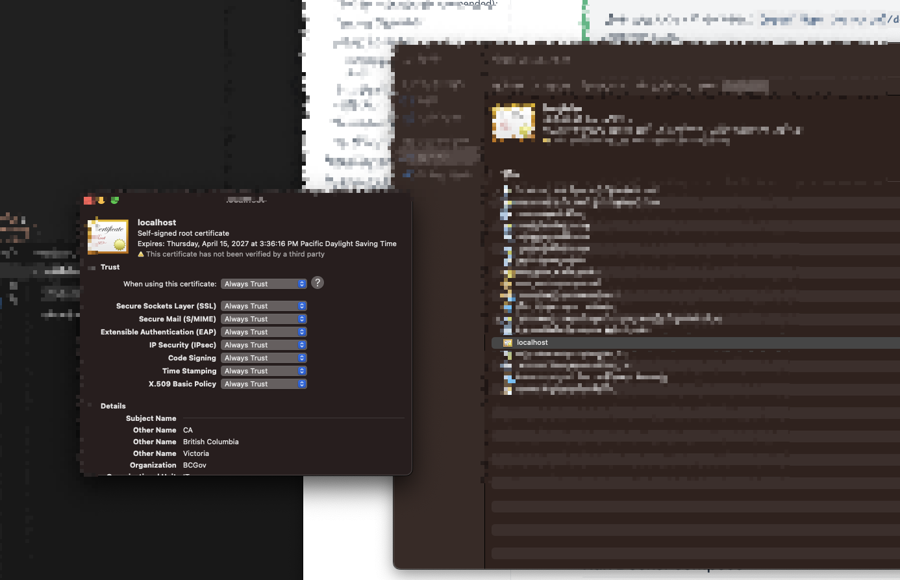
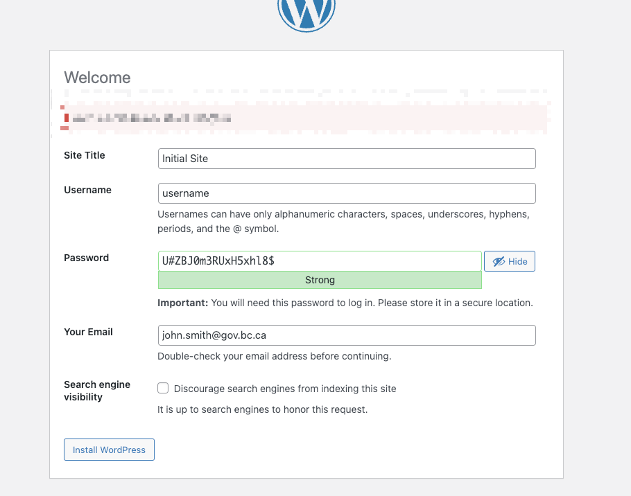

# Deploying WordPress to Docker

## Setup

Clone this repository, and go to the dev directory

```sh:no-line-numbers
# Clone WordPress deployment repository
git clone https://github.com/bcgov/wordpress.git
# Change directory to the wordpress/dev folder
cd wordpress/dev
# Create an .env by copying the sample .env
cp sample-env .env
```

::: tip
you should be using <https://github.com/bcgov/wordpress> as your local WordPress development.
ensure you pull the latest: `git pull origin main` before you start working on your local WordPress development.
:::

## Environment Basics

- Update variables inside `.env` file to reflect your setup.
  - The `CONTENT_DIR` variable is the location of your WordPress content directory.
  - The `TEMP_DIR` variable can be used to import/export db using the wp-cli command.
::: tip
When Importing and Exporting databases with the `wp cli` This will be the link between the WordPress container and your local machine.
:::
::: warning Optional: Switching to Rancher Desktop
If you are using Docker Desktop, you can switch to Rancher Desktop. This is not required, but it is recommended for a more stable experience.
Rancher Desktop is a free and open-source desktop application that is designed to be lightweight and easy to use.

If you want to use Rancher Desktop:

- Uninstall Docker Desktop
- Install and start Rancher Desktop: https://rancherdesktop.io/
- Don't enable Kubernetes
- run `wp_start` (might have to do this 2x and it should create a network)
- `wp db import /tmp/WordPress/all-sites-2025-04-03.sql` (or whatever the name of your file is)
your site should now be back to normal.
:::

## Setting up SSL on Mac (required)

::: warning
Make sure you are in the folder: **`{local repo location}/dev`** before you run the command below.
:::

```sh:no-line-numbers
# sets up `localhost` self signed certs.
docker compose --file docker-compose-init.yaml run self-signed-certificate-generator
```

- Drag the cert located in **`{local repo location}/dev/certs/nginx/ssl/localhost.crt`** to [KeyChain app](https://support.apple.com/en-ca/guide/keychain-access/kyca2431/mac) section and trust always:

  - Double-click the certificate.
  - Next to Trust, click the arrow and in the dropdown box for "When using this certificate:" select `Always Trust`.



::: tip
If this cert is not working, try refreshing the Keychain or verifying the certificate installation before considering a Mac restart as a last resort.
:::

::: warning
WordPress will now run on localhost port 443, which is exactly the same port that Kubernetes runs on. Therefore, local Kubernetes and WordPress can't be running at the same time.
:::

## Run Docker compose

::: warning
You have to be in the wordpress/dev directory for this to work
:::

```sh:no-line-numbers
# Starts WordPress deployment
docker compose up
# to re-build the images and start WordPress deployment
# The build flag is required, anytime there are changes to the images.
docker compose up --build
# If you enable build in shell scripts, this scripts works from anywhere
# Starts WordPress deployments
wp_start
# Creating a unique WordPress build by using alternative env, and different database
docker compose -p mysite --env-file .env-mysite up
# Creating a unique WordPress build an
```

- ensure that the wp-cli container backs up the latest WP Database
- You should see the following in the terminal:

```shell:no-line-numbers
...
wp-cli-1 | *** Backing up Database in case of disaster ***
wp-cli-1 | Success: Exported to '/tmp/WordPress/all-sites-<yyyy-mm-dd>.sql'.
# (This should be accessible to ~/tmp/WordPress)
...
```

- Access Wordpress at [https://localhost](https://localhost)
- Access PHPMyAdmin at [http://localhost:8081](http://localhost:8081) (Note: does not use https)

When you access Wordpress local for the first time, you will be prompted with the initial setup. You can use this screenshot for reference for what to enter.



Once you have filled out all required inputs, click "Install WordPress"

## Recommended multi-site configuration

::: tip
WordPress (WP) multi-site is a configuration that enables multiple websites on the same WP installation.
:::

- In the WordPress admin UI, go to menu Tools -> Network Setup and click install
- Bring down the WordPress site `docker compose down` (or \<CTRL>-C if docker is in the foreground and then `docker compose down`).
- In your `.env` file, ensure

  - `MULTISITE=1`

- Bring up WordPress site `docker compose up`
- In the WordPress admin UI, go to My Sites -> Network Admin -> Settings and `change Max upload file size` to 10000 and click `Save Changes`


- The WordPress wp-content directory can be found at the path specified in your `.env` file under the `CONTENT_DIR` variable.

## Running Thereafter

- `docker compose up` runs the nginx, db, WordPress php-fpm, and wp-cli containers, this will also output debug.log in the stdout.

- WordPress wp-content directory, can be found at the path specified in your `.env` under variable `CONTENT_DIR`, .

## Creating an Alternative WordPress Instance
::: tip
This is useful for working on projects, where the database, and resources can be distributed in a way, that only requires a simple database import, and file extraction.
:::

There are two variations that can be used, one is by using the existing `.env` or by creating an alternative `.env-mysite` file in which a new location could be setup.

### Creating with Existing .env
- If you choose to use the existing `.env` you will have to reset your `MULTISITE` temporarily  back to `0`, until you create your new multi-site installation, you will also be constrained to the same uploads/folder structure.
```sh:no-line-numbers
# ensure a full docker compose down has been completed
docker composer down
# update your .env file MULTISITE=0

# Run the docker compose up with the --project-name (-p) 
#   to prepend all containers, and volumes with this project name
docker compose --project-name mysite up
# Follow the `Recommended multi-site configuration` 
#   (In the WordPress admin UI, go to menu
#   Tools -> Network Setup and click install)

# Do a docker compose down with the project name
docker compose --project-name mysite down
# update your .env file back to MULTISITE=1

# For any future times run the docker compose up command with the project name
docker compose --project-name mysite up
```
### Creating with New .env-mysite
- If you choose to create a new `.env-mysite` you will still have to go through the process of installing WordPress and multi-site, and will need to include copies of plugins and themes in your new location.
```sh:no-line-numbers
# ensure a full docker compose down has been completed
docker composer down
# update your .env-mysite file MULTISITE=0, and CONTENT_DIR to new directory


# Run the docker compose up with the --project-name (-p) 
#   to prepend all containers, and volumes with this project name
#   use a specific env file
docker compose --project-name mysite --env-file .env-mysite up
# Follow the `Recommended multi-site configuration` 
#   (In the WordPress admin UI, go to menu
#   Tools -> Network Setup and click install)

# Do a docker compose down with the project name
docker compose --project-name mysite down
# update your .env file back to MULTISITE=1

# For any future times run the docker compose up command with the project name and env file
docker compose --project-name mysite --env-file .env-mysite  up
```

## Helper functions

The [Helper functions](./bin/commands.sh) can be linked to run anytime a new terminal window is open by adding it to your `~/.bash_profile`

### Including helper functions in bash profile

::: tip
In order to make the helper functions accessible you need to include them into your bash or zsh profile. These commands then can be run from anywhere on your file system from a terminal window.
:::

If you are using bash, add this to your `~/.bash_profile`.
If you are using Zsh, add this to your `~/.zshrc`.

```bash
if [ -f /location-of-this-repo/wordpress/dev/bin/commands.sh ] ; then
 . /location-of-this-repo/wordpress/dev/bin/commands.sh
fi
```

Once this is done you can use the following commands from any directory

- `wp_start` - Starts WordPress local deployment (docker)
- `wp_stop` - Stops WordPress local deployment (docker)
- `wp_log` - Tails the debug.log in the content directory
- `gowp` - Goes to plugin directory
- `gowp themes` - Goes to themes directory
- `wp_setup_tests` - Sets up WordPress unit testing environment. See the Unit tests section below for instructions.
- `wp_test` - Runs unit tests from the current directory.
- `wpgrep` - Does a grep with certain excludes to directories like .git, node_modules, vendor
- `wp_composer` - Runs the latest php composer
- `wp` - [Wordpress Command line](https://wp-cli.org/) that allows an endless amount of things to be completed with your local WordPress instance.

## Example [WordPress Command Line](https://developer.wordpress.org/cli/commands/) using wp.

- `wp site list` - Shows all the sites.
- `wp plugin list` - gets all the plugins.
- `wp plugin update akismet` - updates akismet plugin

## Backing up full database

This file will get stored in a directory that you determined in your `.env` as the `TEMP_DIR` variable.

```sh:no-line-numbers
# In order for this command to work you need the following in your terminal profile (bash or zsh)
# . /location-of-this-repo/wordpress/dev/bin/commands.sh as shown above
wp db export /tmp/WordPress/all-sites.sql --add-drop-table
```

## Useful Commands for Migration of db
```sh:no-line-numbers
# updating guid and internal links
wp search-replace \
   --url=source-url.com \
   --all-tables-with-prefix \
   #--dry-run \
   source-url.com \
   localhost 

# Updating the location of assets
wp search-replace \
   --url=localhost \
   --all-tables-with-prefix \
   #--dry-run \
   source-url.com/app/uploads/sites/982 \
   localhost/wp-content/uploads/sites/3 
```

## Restoring full database

::: warning
This command will replace your entire database, before running `wp db import` make sure you understand what this command does.
:::

```sh:no-line-numbers
wp db import /tmp/WordPress/all-sites.sql
```

## Unit tests

`wp-cli` provides [a way to set up and perform unit/integration tests](https://developer.wordpress.org/cli/commands/scaffold/plugin-tests/) in WordPress' official testing environment.
If a plugin has been configured to use this method of unit testing, we can run those tests inside this docker deployment.

The WordPress Docker instance must be up and running to use the `wp_setup_tests` or `wp_test` commands (run `wp_start` to start the Docker instance).

### Testing Setup

To set up the WP testing environment inside the WordPress container, run the command `wp_setup_tests` from anywhere.

If you get an error saying `command not found: wp_setup_tests`, follow the steps in the "Helper functions" section above.

### Running tests

1. Navigate to the plugin you want to execute tests on: `cd /path/to/your/plugin-directory`
2. Run `wp_test`.
   - If you get a message saying "No tests executed" the plugin is most likely not configured using the `wp scaffold plugin-tests` command so its tests cannot be executed this way. Run the unit tests locally instead (`composer run test`).
   - If you get a message saying "Have you run bin/install-wp-tests.sh?" you will need to run the `wp_setup_tests` command, then try again.
