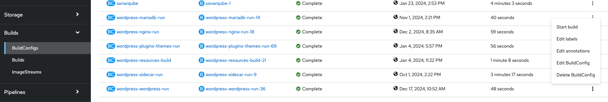

# Deploying WordPress to OpenShift
::: tip
Before any of the commands are executed, you will need to sign in to OpenShift by copying your login command and logging in via the terminal
:::

## Updating Build Configs
Changes to the build configs are required when ever an update to a base image is changed.  This means anytime the WordPress core, MariaDB, Nginx or other base images need to be updated.

- Ensure all base images are updated in the [build configs](https://github.com/bcgov/wordpress/tree/main/deployments/kustomize/image-builds).
- Sync these changes to OpenShift using the `oc apply -k` command to ensure the buildconfig's are up to date and **ensure you change the namespace to your namespace**.
```sh
# update the namespace to your namespace
oc apply -k ./deployments/kustomize/image-builds --namespace='123456-tools'
```

::: warning
Currently there isn't any automation that deploys these changes to OpenShift, which requires a manual process to sync the image buildconfig's to your tools namespace.
:::

## Building Images
Once image buildconfig's have been updated, these images will need to be re-build, and then deployed.
- for all image updates you will need to re-build the image, usually this will be just be the core WordPress, and this will be the example we use.
- Once an image is created, it will add the `dev` tag, as determined by the buildconfig file.


### Building Images VIA OpenShift Application
- Sign in to the OpenShift web application
- Choose your projects tools namespace, and go to 123456-tools project
- Go to the `Builds` - `BuildConfigs` sidebar menu
- choose the BuildConfig `wordpress-wordpress-run` and right mouse click on three horizontal dots to the right, then click `Start build`



### Building Images VIA OC command
```sh
# update the namespace to your namespace
oc start-build --namespace='123456-tools' wordpress-wordpress-run
```
### Promoting the Images to test and prod namespaces.
- Once the image has been created, the dev tag automatically gets assigned.
- Any deployments in the `dev` namespace should automatically re-deploy
- Test a WordPress site in the dev instance to ensure it was successful in updating
- Take notes if the `Network databases` need to be updated, as this will be indicated by a message in the WordPress admin.
- Once confirmation of the new image deployment has been done, then promoted to `test` and `prod`
- promote the image to test.
```sh
# update the namespace to your namespace
oc tag --namespace='123456-tools' wordpress-wordpress-run:dev wordpress-wordpress-run:test
```
- follow same checks as you did with the `dev` namespace
- promote image to production (only if instructed to do so)
```sh
# update the namespace to your namespace
oc tag --namespace='123456-tools' wordpress-wordpress-run:dev wordpress-wordpress-run:prod
```
- follow same checks as you did with the `dev` namespace

## Deploying Plugins / Themes
The plugins and themes requires a Kubernetes Job to be run to update the plugins and themes directories.  A `composer.json` manifest file is used as part of the deployment which deploys the respective plugins and themes to that namespace, and therefor this file might be in a tenant repository.

- update the `composer.json` file to the correct versions and dependencies
- run the `oc apply -k` command
```sh
oc apply -k --namespace='123456-dev' ./deployments/kustomize/base/plugins_themes
```
- if an overlay is created, then run a similar command using a kustomize overlay file and composer.json file.
```sh
oc apply -k --namespace='123456-dev' ./wordpress/kustomize/overlays/dev/plugins_themes
```

### Sample plugins/themes kustomize overlay file

```yaml
# tenant repo
# ./wordpress/kustomize/overlays/dev/plugins_themes
apiVersion: kustomize.config.k8s.io/v1beta1
kind: Kustomization
resources:
- github.com/bcgov/wordpress/deployments/base/plugins_themes
# Update to your license plate in the dev|test|prod namespace.
namespace: 123456-dev
images:
  - name: wordpress-plugins-themes-run
    newName: image-registry.openshift-image-registry.svc:5000/123456-tools/wordpress-plugins-themes-run
    newTag: dev
configMapGenerator:
- name: wordpress-plugins-themes-config
  behavior: replace
  files:
  - composer.json
```

### Sample composer.json file
@[code json](../../../../deployments/kustomize/base/plugins_themes/composer.json)
::: tip
The plugins and themes deployment should be included into a tenant repo in order to account for different deployment considerations for each environment.
:::

## Deploy WordPress
WordPress deployments need to be setup using ArgoCD and Vault Secrets.  
- see [existing deployment documentation](https://github.com/bcgov/wordpress/blob/main/deployments/kustomize/README.md)

## Base Image versions
::: tip
The version of the images below reflect the versions of the actual buildconfig's. `./deployments/kustomize/image-builds`  
:::

### Nginx Base Image
`wordpress-nginx-run` - The base image used for the nginx container. Nginx web server, used to serve WordPress / PHP
@[code{29-29} yaml:no-line-numbers](../../../../deployments/kustomize/image-builds/nginx-build.yaml)

### WordPress Base Image
`wordpress-wordpress-run` - The base image used for the wordpress container 
@[code{29-29} yaml:no-line-numbers](../../../../deployments/kustomize/image-builds/wordpress-build.yaml)

### MariaDB Base Image
`wordpress-mariadb-run` - MariaDB version that gets build in base-images via Dockerfile. Dependent on the [Alpine version](https://pkgs.alpinelinux.org/packages?name=mariadb&branch=v3.20&repo=&arch=x86_64&origin=&flagged=&maintainer=) 
@[code{23-23} yaml:no-line-numbers](../../../../deployments/kustomize/image-builds/mariadb-build.yaml)

### Sidecar Base Image 
`wordpress-sidecar-run` - The base image used for the sidecar image 
@[code{37-37} yaml:no-line-numbers](../../../../deployments/kustomize/image-builds/sidecar-build.yaml)

### Plugin/Themes Base Image 
`wordpress-plugins-themes-run` - The base image used for the plugins/themes image 
@[code{39-39} yaml:no-line-numbers](../../../../deployments/kustomize/image-builds/plugins-themes-build.yaml)


::: warning
**OpenShift template deployments are deprecated**
Use of the OpenShift templates including image builds and deployments will be deprecated in favour of using Kustomize deployments.  Refer to [OpenShift Template Deployment](https://github.com/bcgov/wordpress/tree/bb8fd6066bcc2087605c50f941b8b906dc0e9b61/openshift/templates)
:::

## Resources
- [BCGov ArgoCD Application Setup](https://developer.gov.bc.ca/docs/default/component/platform-developer-docs/docs/automation-and-resiliency/argo-cd-usage/#create-the-application)
- [BCGov Vault Secrets](https://developer.gov.bc.ca/docs/default/component/platform-developer-docs/docs/secrets-management/vault-getting-started-guide/)